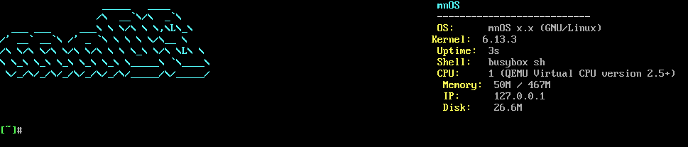

# mnOS

[English](README.md) | [中文](README.zh.md)

A minimal Linux distribution built from scratch: **Linux 6.13.3 + busybox + GRUB**, a complete FHS tree, shipped as a bootable ISO (BIOS + UEFI) that greets you with a colorful system-info card.



## Features

- Complete FHS layout (`/bin /etc /usr /var /proc /sys ...`)
- busybox userland with 400+ applets (sh, vi, top, grep, awk, ...)
- Auto-login shell: once the boot logs settle it **clears the screen and prints a system-info card**
- Colored prompt `[\W]#` plus shortcuts `off` (poweroff), `rb` (reboot), `ll` (ls -l)
- GRUB menu and kernel framebuffer both at **1280×720 (16:9)**
- Dual console output (serial + VGA): commands like `ls` and `mneofetch` render on both
- Single packed rootfs in initramfs, fast boot (~3 s to shell)

## Run

```bash
# graphical (GRUB menu + VGA console)
qemu-system-x86_64 -enable-kvm -m 512 -cdrom mnOSv1.5.iso

# serial console (interact right in your terminal)
qemu-system-x86_64 -enable-kvm -m 512 -cdrom mnOSv1.5.iso -nographic
```

## Build

### One-shot build

```bash
./build.sh          # repack initramfs and produce ../mnOSv1.5.iso
```

Requires `grub-mkrescue`, `cpio`, `gzip`, and the kernel's `gen_init_cpio`
(override with `GEN_INIT_CPIO=/path/to/gen_init_cpio`; `OUT=...` sets the output
path; `KERNEL_SRC=...` sets the kernel source dir).

### Prerequisites (kernel / busybox)

#### 1. Kernel

```bash
git clone --depth=1 -b v6.13.3 https://github.com/torvalds/linux.git
cd linux
make olddefconfig          # key options: BLK_DEV_INITRD, DEVTMPFS, VT, DRM_BOCHS,
                           # FRAMEBUFFER_CONSOLE, SERIAL_8250_CONSOLE, ISO9660_FS
make -j$(nproc)
cp arch/x86/boot/bzImage ../
```

#### 2. busybox

```bash
git clone https://git.busybox.net/busybox
cd busybox
make defconfig             # dynamic linking (CONFIG_STATIC is not set)
make -j$(nproc)
make CONFIG_PREFIX=../mnOS install
```

The rootfs also needs the glibc libraries busybox depends on:

```bash
mkdir -p mnOS/lib/x86_64-linux-gnu
cp -a /lib/x86_64-linux-gnu/{libc,libm,libresolv,libnss_files,libnss_dns}-2.31.so* \
      /lib/x86_64-linux-gnu/ld-2.31.so mnOS/lib/x86_64-linux-gnu/
ln -sf /lib/x86_64-linux-gnu/ld-2.31.so mnOS/lib64/ld-linux-x86-64.so.2
printf '/lib/x86_64-linux-gnu\n/usr/lib/x86_64-linux-gnu\n' > mnOS/etc/ld.so.conf
ldconfig -r mnOS
```

#### 3. initramfs (no root needed)

Device nodes are written straight into the cpio header with the kernel's
`gen_init_cpio` — no `mknod`, no root:

```bash
cat > devspec <<'EOF'
dir /dev 0755 0 0
nod /dev/console 0600 0 0 c 5 1
nod /dev/tty      0666 0 0 c 5 0
nod /dev/tty0     0600 0 0 c 4 0
nod /dev/tty1     0600 0 0 c 4 1
nod /dev/ttyS0    0666 0 0 c 4 64
nod /dev/null     0666 0 0 c 1 3
nod /dev/zero     0666 0 0 c 1 5
nod /dev/random   0666 0 0 c 1 8
nod /dev/urandom  0666 0 0 c 1 9
nod /dev/ptmx     0666 0 0 c 5 2
EOF
linux/usr/gen_init_cpio devspec > dev.cpio

# concatenate two archives: devices first, filesystem second (the kernel
# understands concatenated cpio)
cd mnOS
find . -path ./boot -prune -o -path ./.git -prune -o -print | cpio --owner 0:0 -H newc -o > ../tree.cpio
cd ..
cat dev.cpio tree.cpio | gzip -9 > mnOS/boot/initramfs.cpio.gz
```

#### 4. Build the ISO

```bash
mkdir -p staging/boot/grub
cp mnOS/boot/bzImage        staging/boot/
cp mnOS/boot/initramfs.cpio.gz staging/boot/

cat > staging/boot/grub/grub.cfg <<'EOF'
insmod all_video
if loadfont unicode; then
    set gfxmode=1280x720
    set gfxpayload=1280x720
    terminal_output gfxterm
fi
set timeout=5
set default=0
menuentry "mnOS" {
    linux /boot/bzImage video=Virtual-1:1280x720 console=tty0 console=ttyS0,115200
    initrd /boot/initramfs.cpio.gz
}
EOF

grub-mkrescue -o mnOSv1.5.iso staging/
```

## Layout

```text
mnOS/
├── init            # PID 1: mount proc/sys/devtmpfs/pts, then exec /sbin/init
├── bin/            # busybox + applet symlinks (includes the mneofetch card)
├── sbin/           # init, getty, ...
├── etc/
│   ├── inittab     # sysinit + dual-console shell
│   ├── init.d/rcS  # mount fs → wait for logs to settle → clear → print the card
│   ├── profile     # colored PS1, shortcut aliases
│   └── ...
├── boot/           # bzImage + initramfs.cpio.gz
├── assets/         # README screenshot
├── build.sh        # one-shot build script
├── lib/, lib64/    # glibc runtime and dynamic loader
└── proc/ sys/ dev/ ...  # standard FHS dirs (mounted at runtime)
```

## Technical notes

| Problem | Solution |
|---------|----------|
| Can't `mknod` without root | use the kernel's `gen_init_cpio` to emit device nodes into the cpio |
| Kernel stops auto-mounting devtmpfs once `/init` exists | mount proc/sysfs/devtmpfs manually in `/init` |
| Which console `/dev/console` points to | determined by the order of `console=` args; put `ttyS0` last |
| DRM ignores GRUB's `gfxpayload` resolution | force it with `video=Virtual-1:1280x720` |
| GRUB theme silently breaks | drop the `terminal-*` fields (they make theme parsing fail) |
| Concatenated cpio swallowed as a regular file | generate the archives separately and `cat` them; don't pipe into `find` |

## License

mnOS's own code (the `init` process, `build.sh`, the startup scripts under
`etc/` and `bin/mneofetch`) is licensed under **GPL-3.0-or-later** — see
[LICENSE](LICENSE).

The mnOS image is distributed as an **aggregate**: it bundles third-party
software under their own licenses, notably Linux and BusyBox (GPL-2.0-only),
glibc (LGPL-2.1-or-later), GRUB and nano (GPL-3.0-or-later), Vim (Vim License),
Python (PSF License) and tcc (LGPL-2.1). See [NOTICE](NOTICE) for the full list,
upstream sources and how to obtain the Corresponding Source. The image is not
relicensed as a whole.
